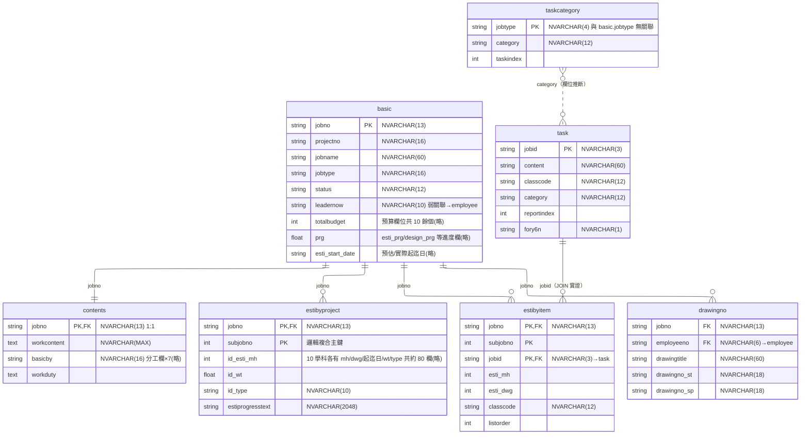
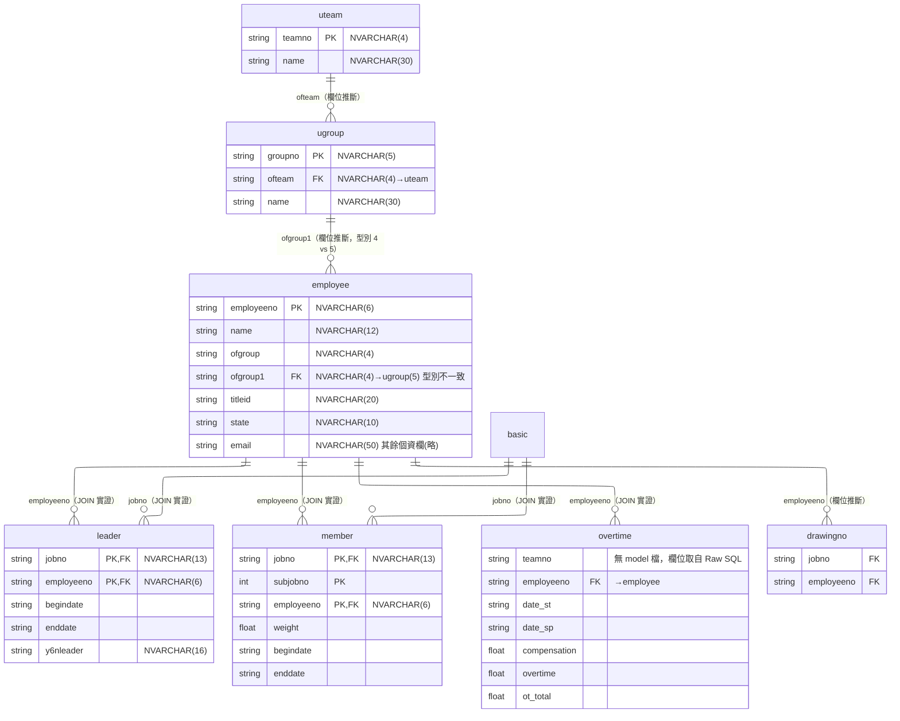
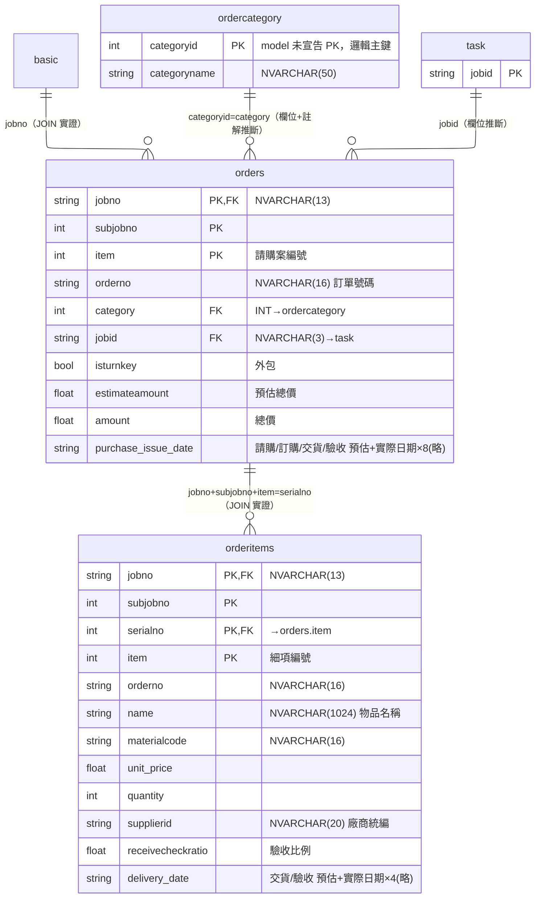
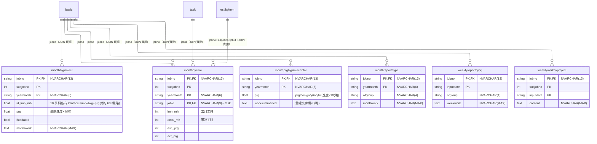
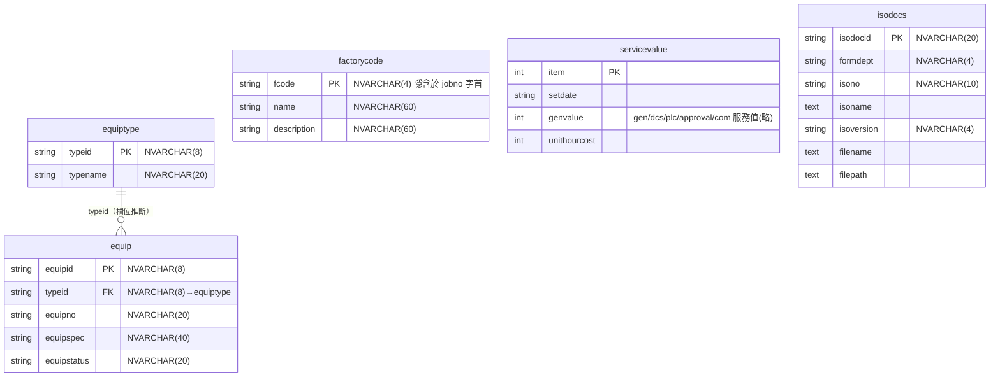

# PI 資料庫 ER Model

依據 `server/models/*.model.js`（26 個 model）與 `server/ctrl/*.js` 的 Raw SQL JOIN 條件推導（2026-07-23 盤點）。

- Model 檔案本身**沒有定義任何 Sequelize association**，以下關聯來源分三級：
  - **JOIN 實證**：controller Raw SQL 實際 JOIN 的欄位
  - **欄位推斷**：兩表欄位同名同型別，且前端有對應查詢行為
  - **弱關聯**：語意上應相關但型別不一致或僅隱含於編碼規則
- 型別對照：`STRING(n)` → NVARCHAR(n)、`TEXT` → NVARCHAR(MAX)、`INTEGER` → INT、`FLOAT` → FLOAT、`BOOLEAN` → BIT；日期欄位多以字串儲存
- 圖中標示的 PK 為**邏輯主鍵**（依資料語意與 JOIN 條件推斷）；model 宣告的 PK 大多與事實不符，詳見文末注意事項
- 各圖已設定 `layout: elk`（排線較整齊）；mermaid.live、mermaid-cli、VS Code 新版擴充支援，GitHub 網頁渲染尚不支援會靜默退回 dagre 排版

## 1. 專案核心

## 2. 人員與組織

## 3. 採購

## 4. 進度與報表

## 5. 獨立表（無關聯或僅隱含關聯）

## 關聯一覽表

| # | 父表 | 子表 | 關聯欄位 | 基數 | 依據 |
|---|------|------|----------|------|------|
| 1 | basic | contents | jobno | 1:1 | 欄位推斷（PD01/PD02 頁面行為） |
| 2 | basic | estibyproject | jobno | 1:N（每 subjobno 一筆） | 欄位推斷 |
| 3 | basic | estibyitem | jobno | 1:N | 欄位推斷 |
| 4 | basic | leader | jobno | 1:N | JOIN 實證（common/joblist/leader.ctrl） |
| 5 | basic | member | jobno | 1:N | JOIN 實證（joblist/member.ctrl） |
| 6 | basic | drawingno | jobno | 1:N | 欄位推斷 |
| 7 | basic | orders | jobno | 1:N | JOIN 實證（common.ctrl） |
| 8 | basic | monthbyproject | jobno(+subjobno) | 1:N | JOIN 實證（joblist.ctrl 經 member） |
| 9 | basic | monthbyitem | jobno | 1:N | 欄位推斷 |
| 10 | basic | monthprgbyprojecttotal | jobno | 1:N | 欄位推斷 |
| 11 | basic | monthreportbyprj | jobno | 1:N | JOIN 實證（monthreportbyprj.ctrl 經 weeklyreportbyprj） |
| 12 | basic | weeklyreportbyprj | jobno | 1:N | JOIN 實證（weeklyreportbyprj.ctrl） |
| 13 | basic | weeklyworkbyproject | jobno | 1:N | JOIN 實證（weeklyreportbyprj.ctrl） |
| 14 | employee | leader | employeeno | 1:N | JOIN 實證 |
| 15 | employee | member | employeeno | 1:N | JOIN 實證 |
| 16 | employee | drawingno | employeeno | 1:N | 欄位推斷 |
| 17 | employee | overtime | employeeno | 1:N | JOIN 實證（common.ctrl 加班統計；overtime 無 model） |
| 18 | uteam | ugroup | teamno←ofteam | 1:N | 欄位推斷（前端 groupSvc.getBy({ofteam})） |
| 19 | ugroup | employee | groupno←ofgroup1 | 1:N | 欄位推斷；**型別不一致 5 vs 4** |
| 20 | orders | orderitems | jobno+subjobno+item←serialno | 1:N | JOIN 實證（common.ctrl 採購金額系列） |
| 21 | ordercategory | orders | categoryid←category | 1:N | 欄位+程式註解推斷（型別已一致，皆 INT） |
| 22 | task | estibyitem | jobid | 1:N | JOIN 實證（estibyitem.ctrl） |
| 23 | task | monthbyitem | jobid | 1:N | JOIN 實證（monthbyitem.ctrl） |
| 24 | task | orders | jobid | 1:N | 欄位推斷 |
| 25 | estibyitem | monthbyitem | jobno+subjobno+jobid | 1:N | JOIN 實證（common.ctrl KPI） |
| 26 | taskcategory | task | category | N:N（弱） | 欄位推斷（jobtype 與 basic.jobtype **無關聯**，僅同名） |
| 27 | equiptype | equip | typeid | 1:N | 欄位推斷 |
| 28 | employee | basic | employeeno←leadernow | 1:N（弱） | 弱關聯；**型別不一致 6 vs 10** |
| 29 | factorycode | basic | fcode←jobno 字首 | 1:N（隱含） | 編碼規則推斷 |

## 注意事項

1. **Model 宣告的 PK 與邏輯主鍵不符**：除 basic、contents、employee、uteam、ugroup、task、taskcategory、equip、equiptype、factorycode、servicevalue、isodocs 外，其餘 model 都把 `jobno` 宣告為 `primaryKey: true, unique: true`，但實際為一對多明細表，邏輯主鍵是複合鍵（如 member = jobno+subjobno+employeeno、monthbyproject = jobno+subjobno+yearmonth、orderitems = jobno+subjobno+serialno+item）。因為所有讀寫都走 Raw SQL，Sequelize 的 PK 宣告未被使用，暫無實害，但不可依 model 宣告理解資料結構。
2. **型別不一致（2 處，待確認 DB 實際欄寬）**：
   - `basic.leadernow` NVARCHAR(10) vs `employee.employeeno` NVARCHAR(6)
   - `employee.ofgroup/ofgroup1`、`monthreportbyprj.ofgroup`、`weeklyreportbyprj.ofgroup` NVARCHAR(4) vs `ugroup.groupno` NVARCHAR(5)
3. **`ordercategory` 未宣告 PK**：唯一沒有 `primaryKey: true` 的 model，Sequelize 會自動補 `id` 欄位（Raw SQL 下無影響）；邏輯主鍵為 `categoryid`。
4. **`overtime` 資料表沒有 model 檔**：僅存在於 `common.ctrl.js` 加班統計的 Raw SQL 中，欄位清單取自 SQL（teamno、employeeno、date_st、date_sp、compensation、overtime、ot_total），完整結構需查 DB。
5. **子工程（subjobno）沒有主檔**：專案主檔 basic 只有 jobno，子工程以 (jobno, subjobno) 散落在 estibyproject、member、orders 等表，無獨立的 subjob 資料表。
6. **日期欄位幾乎都是字串**（`DataTypes.STRING` 未定長度 → NVARCHAR(255)），僅少數以 convert 轉型；排序與區間查詢依賴字串格式一致性。
